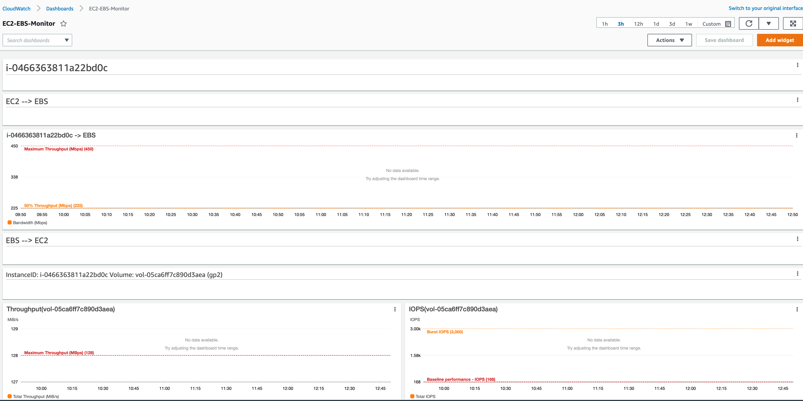

# Optimize SQL Workloads with Amazon CloudWatch

The script takes an instance-id list as input, and it will create a dashboard with all the attached EBS volumes and their limits. The automatic annotation function will create a red line that indicates the maximum of each resource.

To use the script, run the following code snippet.

```
# Prerequisites 
python3 -m venv env 
source env/bin/activate
pip3 install -r requirements.txt

# Running the script
python3 create-cw-dashboard.py --InstanceList i-example1 i-example2 --region eu-west-1
```

Here is an example of the output



You will need to make sure you have an access key, and secret key configured on the machine see [Link](https://docs.aws.amazon.com/IAM/latest/UserGuide/id_credentials_access-keys.html) 